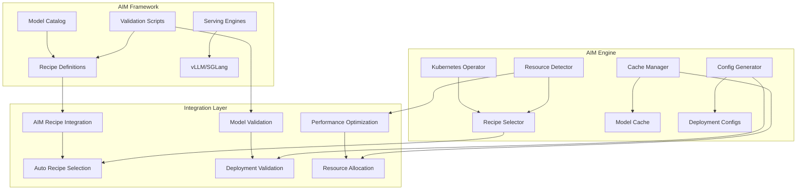

# AIM Engine Integration with AIM Framework

## Overview

This document explains how **AIM Engine** integrates with the **AIM (AMD Inference Microservice)** framework to provide intelligent, automated deployment and management of AI models on AMD hardware.

## AIM Framework vs AIM Engine

### AIM Framework
- **Definition**: A comprehensive framework for deploying and serving AI models on AMD hardware
- **Components**: Model catalogs, recipe definitions, validation scripts, serving engines
- **Purpose**: Provides standardized configurations and best practices for AMD GPU inference

### AIM Engine
- **Definition**: An intelligent AI model deployment system that automates AIM framework usage
- **Components**: Kubernetes operator, recipe selection engine, caching system, resource management
- **Purpose**: Orchestrates and optimizes AIM deployments with zero configuration

## Integration Architecture



## Key Integration Points

### 1. Recipe Integration

AIM Engine automatically discovers and utilizes AIM framework recipes:

```yaml
# AIM Framework Recipe (from AIM_DEFINITION.md)
recipe_id: qwen3-32b-mi250-bf16
model_id: Qwen/Qwen3-32B
hardware: MI250
precision: bf16

vllm_serve:
  "4_gpu":
    enabled: true
    args:
      --model: Qwen/Qwen3-32B
      --dtype: bfloat16
      --tensor-parallel-size: "4"
      --max-batch-size: "24"
      --max-context-len: "32768"
      --gpu-memory-utilization: "0.9"
      --trust-remote-code: "true"
      --port: "8000"
```

```yaml
# AIM Engine Custom Resource (simplified)
apiVersion: aim.engine.amd.com/v1alpha1
kind: AIMEndpoint
metadata:
  name: qwen3-32b-inference
spec:
  model: Qwen/Qwen3-32B
  hardware: MI250
  precision: bf16
  gpuCount: 4
  # AIM Engine automatically selects optimal recipe
```

### 2. Automatic Recipe Selection

AIM Engine's intelligent recipe selection process:

1. **Model Analysis**: Analyzes model size and requirements
2. **Hardware Detection**: Detects available AMD GPUs
3. **Recipe Matching**: Finds optimal AIM framework recipe
4. **Configuration Optimization**: Applies performance optimizations
5. **Deployment**: Deploys using AIM framework configurations

### 3. Validation Integration

AIM Engine leverages AIM framework validation:

```python
# AIM Framework validation (from AIM_DEFINITION.md)
python3 src/aim_engine/aim_recipe_selector.py --validate --recipe config/recipes/qwen3-32b-mi250-bf16.yaml

# AIM Engine validation integration
kubectl apply -f aimendpoint.yaml
# AIM Engine automatically validates using AIM framework scripts
```

### 4. Serving Engine Integration

AIM Engine supports both vLLM and SGLang from AIM framework:

```yaml
# AIM Engine supports multiple serving engines
spec:
  servingEngine: vllm  # or sglang
  # AIM Engine automatically configures using AIM framework recipes
```

## Integration Benefits

### 1. Zero Configuration Deployment

**Without AIM Engine**:
```bash
# Manual AIM framework usage
1. Find appropriate recipe
2. Validate recipe manually
3. Configure hardware settings
4. Set up serving engine
5. Deploy and monitor
```

**With AIM Engine**:
```bash
# Automated deployment
kubectl apply -f aimendpoint.yaml
# AIM Engine handles everything automatically
```

### 2. Intelligent Resource Management

AIM Engine enhances AIM framework with:

- **Dynamic GPU Allocation**: Automatically selects optimal GPU count
- **Memory Optimization**: Intelligent memory utilization based on model size
- **Performance Tuning**: Automatic parameter optimization
- **Caching**: Persistent model caching for faster deployments

### 3. Production Readiness

AIM Engine adds production features to AIM framework:

- **Kubernetes Integration**: Native Kubernetes deployment and management
- **Health Monitoring**: Comprehensive health checks and monitoring
- **Scaling**: Automatic scaling based on demand
- **High Availability**: Multi-pod deployments with load balancing

## Implementation Examples

### Example 1: Simple Model Deployment

```yaml
# AIM Engine Custom Resource
apiVersion: aim.engine.amd.com/v1alpha1
kind: AIMEndpoint
metadata:
  name: llama-3-8b-inference
spec:
  model: meta-llama/Llama-3-8B-Instruct
  hardware: MI250
  precision: fp16
  gpuCount: 1
  servingEngine: vllm
```

**AIM Engine automatically**:
1. Finds `llama-3-8b-mi250-fp16.yaml` recipe from AIM framework
2. Validates configuration using AIM framework validation scripts
3. Applies optimal vLLM settings from recipe
4. Deploys with intelligent caching and monitoring

### Example 2: Large Model with Auto-Scaling

```yaml
# AIM Engine Custom Resource
apiVersion: aim.engine.amd.com/v1alpha1
kind: AIMEndpoint
metadata:
  name: qwen3-32b-inference
spec:
  model: Qwen/Qwen3-32B
  hardware: MI300X
  precision: bf16
  gpuCount: 4
  servingEngine: vllm
  autoScaling:
    enabled: true
    minReplicas: 1
    maxReplicas: 3
```

**AIM Engine automatically**:
1. Selects `qwen3-32b-mi300x-bf16.yaml` recipe
2. Configures 4-GPU tensor parallelism
3. Sets up auto-scaling with AIM framework optimizations
4. Monitors performance and scales as needed

### Example 3: Multi-Engine Deployment

```yaml
# AIM Engine Custom Resource
apiVersion: aim.engine.amd.com/v1alpha1
kind: AIMEndpoint
metadata:
  name: qwen3-32b-multi-engine
spec:
  model: Qwen/Qwen3-32B
  hardware: MI250
  precision: bf16
  gpuCount: 2
  servingEngines:
    - vllm
    - sglang
```

**AIM Engine automatically**:
1. Uses AIM framework recipe with both vLLM and SGLang configurations
2. Deploys both serving engines with optimal settings
3. Provides unified API endpoints for both engines
4. Manages resource allocation between engines

## Configuration Mapping

### AIM Framework → AIM Engine Mapping

| AIM Framework | AIM Engine | Description |
|---------------|------------|-------------|
| `recipe_id` | `metadata.name` | Unique identifier |
| `model_id` | `spec.model` | Model identifier |
| `hardware` | `spec.hardware` | Target hardware |
| `precision` | `spec.precision` | Precision format |
| `vllm_serve` | `spec.servingEngine: vllm` | vLLM configuration |
| `sglang_serve` | `spec.servingEngine: sglang` | SGLang configuration |
| `args` | Auto-generated | Serving engine arguments |

### Advanced Configuration

AIM Engine supports advanced AIM framework features:

```yaml
# AIM Engine with custom AIM framework overrides
spec:
  model: Qwen/Qwen3-32B
  hardware: MI250
  precision: bf16
  gpuCount: 4
  servingEngine: vllm
  customArgs:
    --max-batch-size: "32"  # Override recipe default
    --max-context-len: "16384"  # Override recipe default
  aimFrameworkOverrides:
    gpuMemoryUtilization: "0.95"  # Override memory utilization
    trustRemoteCode: true  # Enable remote code
```

## Best Practices

### 1. Recipe Selection

- **Use Standard Models**: Prefer models with existing AIM framework recipes
- **Hardware Matching**: Ensure hardware matches available GPUs
- **Precision Optimization**: Choose precision based on quality/performance needs

### 2. Performance Optimization

- **GPU Count**: Start with recommended GPU count from AIM framework
- **Batch Size**: Use AIM framework recommendations as starting point
- **Memory Utilization**: Adjust based on model size and hardware

### 3. Production Deployment

- **Health Checks**: Enable comprehensive health monitoring
- **Auto-scaling**: Use auto-scaling for variable workloads
- **Caching**: Leverage AIM Engine's intelligent caching
- **Monitoring**: Set up proper monitoring and alerting

## Troubleshooting

### Common Integration Issues

#### Recipe Not Found
```bash
# Check available recipes
kubectl get aimrecipe -n aim-engine

# Verify model compatibility
kubectl describe aimrecipe <recipe-name>
```

#### Validation Errors
```bash
# Check AIM framework validation
kubectl logs -n aim-engine deployment/aim-engine-operator

# Verify recipe syntax
python3 src/aim_engine/aim_recipe_selector.py --validate --recipe <recipe-file>
```

#### Performance Issues
```bash
# Check resource allocation
kubectl top pods -n aim-engine

# Verify GPU utilization
nvidia-smi  # or rocm-smi for AMD GPUs
```

## Future Enhancements

### Planned Integration Features

1. **Auto-Recipe Generation**: Automatic recipe creation for new models
2. **Performance Benchmarking**: Automated performance testing and optimization
3. **Multi-Model Serving**: Support for multiple models on single hardware
4. **Cloud Integration**: Seamless cloud deployment with AIM framework recipes

### Community Contributions

- **New Recipe Support**: Contribute AIM framework recipes for new models
- **Hardware Optimization**: Optimize recipes for specific hardware configurations
- **Serving Engine Integration**: Add support for new serving engines
- **Validation Improvements**: Enhance validation and testing capabilities

## Resources

### Documentation
- [AIM Definition](AIM_DEFINITION.md) - Comprehensive AIM framework overview
- [AIM Engine Overview](AIM_ENGINE_OVERVIEW.md) - AIM Engine architecture and design
- [Recipe Guide](RECIPE_GUIDE.md) - Recipe system documentation
- [API Reference](API.md) - AIM Engine API documentation

### Examples
- [Basic Deployment](../examples/kubernetes/basic-aim/) - Simple AIM deployment
- [Advanced Configuration](../examples/kubernetes/scalable-aim/) - Advanced AIM configuration
- [Multi-Model Setup](../examples/kubernetes/multi-model/) - Multiple model deployment

### Tools
- [Recipe Validator](../src/aim_engine/aim_recipe_selector.py) - AIM framework recipe validation
- [Performance Monitor](../src/aim_engine/) - AIM Engine monitoring tools
- [Deployment Scripts](../scripts/) - Automated deployment scripts

---

*Last updated: January 2025* 