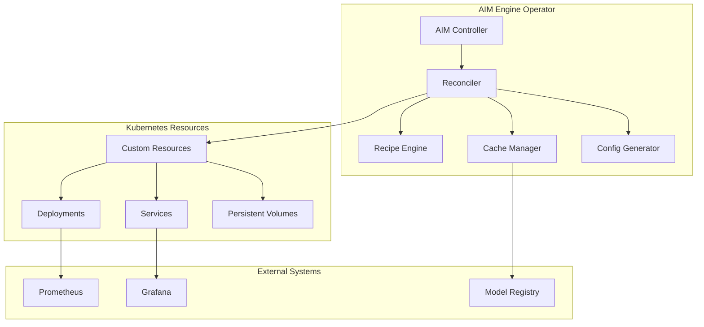

# AIM Engine Kubernetes Operator Transformation Path

## Overview

This document outlines the strategic path to transform AIM Engine from its current containerized deployment model into a full-fledged Kubernetes operator. The transformation leverages AIM Engine's existing recipe selection, cache management, and configuration generation capabilities to create a Kubernetes-native AI model serving platform.

## Current AIM Engine Capabilities

### 1. **Recipe Selection Engine** (`aim_recipe_selector.py`)
- **Intelligent Configuration Selection**: Automatically selects optimal deployment configurations based on model, GPU count, precision, and backend
- **Hardware Detection**: Detects available GPUs and system resources
- **Performance Optimization**: Chooses best-performing recipes from validated configurations
- **Multi-Backend Support**: Supports vLLM, SGLang, and other serving backends
- **Lazy Loading**: Efficient recipe loading on-demand per model

### 2. **Cache Management System** (`aim_cache_manager.py`)
- **Model Caching**: Optimizes deployments by caching model files
- **Cache Indexing**: Maintains metadata about cached models
- **Storage Optimization**: Manages disk space and cleanup
- **Environment Generation**: Creates cache-aware deployment configurations

### 3. **Configuration Generator** (`aim_config_generator.py`)
- **Dynamic Configuration**: Generates deployment configurations from recipes
- **Resource Optimization**: Calculates optimal resource requirements
- **Environment Variables**: Sets up proper runtime environment
- **Command Generation**: Creates optimized vLLM/serving commands

### 4. **Recipe-Based Architecture**
- **YAML-Based Recipes**: Declarative configuration for different models and hardware
- **Performance Validation**: Pre-validated configurations for various GPU counts
- **Hardware-Specific Optimization**: Tailored for AMD MI300X and other GPUs
- **Scalability Support**: Configurations for 1-8+ GPU deployments

## Kubernetes Operator Transformation Strategy

### Phase 1: Foundation (Current State)
**Status**: ✅ **Complete**

- Containerized AIM Engine with recipe selection
- Docker-based deployment with GPU support
- Basic Kubernetes manifests (Helm charts)
- Recipe-based configuration system

### Phase 2: Custom Resource Definitions (CRDs)
**Status**: ✅ **Complete**

#### AIMEndpoint CRD
```yaml
apiVersion: apiextensions.k8s.io/v1
kind: CustomResourceDefinition
metadata:
  name: aimendpoints.aim.engine.amd.com
spec:
  group: aim.engine.amd.com
  names:
    kind: AIMEndpoint
    plural: aimendpoints
  scope: Namespaced
  versions:
    - name: v1alpha1
      schema:
        openAPIV3Schema:
          type: object
          properties:
            spec:
              type: object
              properties:
                modelId:
                  type: string
                gpuCount:
                  type: integer
                precision:
                  type: string
                backend:
                  type: string
                autoSelect:
                  type: boolean
```

#### AIMRecipe CRD
```yaml
apiVersion: apiextensions.k8s.io/v1
kind: CustomResourceDefinition
metadata:
  name: aimrecipes.aim.engine.amd.com
spec:
  group: aim.engine.amd.com
  names:
    kind: AIMRecipe
    plural: aimrecipes
  scope: Cluster
  versions:
    - name: v1alpha1
      schema:
        openAPIV3Schema:
          type: object
          properties:
            spec:
              type: object
              properties:
                recipeId:
                  type: string
                modelId:
                  type: string
                hardware:
                  type: string
                precision:
                  type: string
                configurations:
                  type: object
```

#### AIMCache CRD
```yaml
apiVersion: apiextensions.k8s.io/v1
kind: CustomResourceDefinition
metadata:
  name: aimcaches.aim.engine.amd.com
spec:
  group: aim.engine.amd.com
  names:
    kind: AIMCache
    plural: aimcaches
  scope: Namespaced
  versions:
    - name: v1alpha1
      schema:
        openAPIV3Schema:
          type: object
          properties:
            spec:
              type: object
              properties:
                modelId:
                  type: string
                cachePath:
                  type: string
                size:
                  type: string
```

### Phase 3: Controller Implementation
**Status**: ✅ **Complete**

#### Core Controller Logic
The operator controller implements the reconciliation loop:

```go
// Reconcile AIMEndpoint
func (r *AIMEndpointReconciler) Reconcile(ctx context.Context, req ctrl.Request) (ctrl.Result, error) {
    // 1. Fetch AIMEndpoint
    // 2. Apply recipe selection logic
    // 3. Generate deployment configuration
    // 4. Create/update Kubernetes resources
    // 5. Monitor deployment status
    // 6. Update endpoint status
}
```

#### Key Controller Features
- **Recipe Selection Integration**: Uses existing `AIMRecipeSelector` logic
- **Cache Management**: Leverages `AIMCacheManager` for model caching
- **Configuration Generation**: Applies `AIMConfigGenerator` for deployment configs
- **Resource Management**: Handles GPU allocation and resource limits
- **Health Monitoring**: Tracks endpoint health and performance

### Phase 4: Advanced Features
**Status**: 🔄 **In Progress**

#### 1. **Admission Controllers**
- **Recipe Validation**: Validates AIMEndpoint configurations against available recipes
- **Resource Validation**: Ensures GPU requirements can be met
- **Security Policies**: Enforces security and access controls

#### 2. **Monitoring Integration**
- **Custom Metrics**: Exposes recipe performance metrics
- **Prometheus Integration**: Provides monitoring endpoints
- **Grafana Dashboards**: Pre-configured dashboards for AIM endpoints

#### 3. **Multi-Model Support**
- **Model Orchestration**: Manages multiple models on shared hardware
- **Resource Sharing**: Optimizes GPU utilization across models
- **Load Balancing**: Distributes requests across model instances

## Implementation Roadmap

### Immediate Next Steps (Phase 4 Completion)

#### 1. **Enhanced Controller Features**
```bash
# Deploy operator with advanced features
kubectl apply -f k8s/operator/config/crd/bases/
kubectl apply -f k8s/operator/config/rbac/
kubectl apply -f k8s/operator/config/manager/
```

#### 2. **Admission Controller Setup**
```yaml
# Validating admission webhook
apiVersion: admissionregistration.k8s.io/v1
kind: ValidatingWebhookConfiguration
metadata:
  name: aim-engine-validating-webhook
webhooks:
  - name: aimendpoints.aim.engine.amd.com
    rules:
      - apiGroups: ["aim.engine.amd.com"]
        apiVersions: ["v1alpha1"]
        operations: ["CREATE", "UPDATE"]
        resources: ["aimendpoints"]
```

#### 3. **Monitoring Stack**
```yaml
# ServiceMonitor for Prometheus
apiVersion: monitoring.coreos.com/v1
kind: ServiceMonitor
metadata:
  name: aim-engine-monitor
spec:
  selector:
    matchLabels:
      app: aim-engine
  endpoints:
    - port: metrics
      path: /metrics
```

### Medium-Term Goals (Phase 5)

#### 1. **Advanced Orchestration**
- **Horizontal Pod Autoscaling**: Scale based on request load
- **Vertical Pod Autoscaling**: Optimize resource allocation
- **Canary Deployments**: Safe model updates with traffic splitting

#### 2. **Multi-Cluster Support**
- **Federation**: Deploy across multiple Kubernetes clusters
- **Centralized Management**: Single control plane for multiple clusters
- **Cross-Cluster Load Balancing**: Distribute load across clusters

#### 3. **Enterprise Features**
- **RBAC Integration**: Fine-grained access control
- **Audit Logging**: Comprehensive audit trails
- **Compliance**: SOC2, GDPR, and other compliance frameworks

### Long-Term Vision (Phase 6)

#### 1. **AI-Native Features**
- **Auto-Optimization**: Machine learning for recipe selection
- **Predictive Scaling**: Anticipate load and scale proactively
- **Performance Tuning**: Automatic hyperparameter optimization

#### 2. **Ecosystem Integration**
- **Model Registry**: Centralized model management
- **Pipeline Integration**: CI/CD for model deployment
- **API Gateway**: Unified API for multiple models

## Technical Architecture

### Operator Architecture


### Data Flow
1. **User creates AIMEndpoint CR**
2. **Controller reconciles the endpoint**
3. **Recipe Engine selects optimal configuration**
4. **Cache Manager ensures model availability**
5. **Config Generator creates deployment config**
6. **Controller creates Kubernetes resources**
7. **Monitoring tracks performance and health**

## Benefits of Operator Transformation

### 1. **Kubernetes-Native Experience**
- **Declarative Configuration**: Define endpoints using YAML
- **GitOps Integration**: Version control for AI deployments
- **Standard Tooling**: Use kubectl, helm, and other K8s tools

### 2. **Operational Excellence**
- **Automated Lifecycle Management**: Self-healing deployments
- **Resource Optimization**: Efficient GPU and memory usage
- **Monitoring and Observability**: Built-in metrics and logging

### 3. **Scalability and Reliability**
- **Horizontal Scaling**: Scale endpoints based on demand
- **High Availability**: Multi-replica deployments
- **Fault Tolerance**: Automatic recovery from failures

### 4. **Developer Experience**
- **Simplified Deployment**: One command to deploy models
- **Recipe Reuse**: Share and reuse optimized configurations
- **Rapid Iteration**: Quick model updates and rollbacks

## Current Status: CRDs Exist But Not Actively Used

### **✅ What's Implemented:**

1. **CRDs Are Defined**: The AIM Engine CRDs are fully defined and exist in the codebase:
   - `aim.engine.amd.com_aimendpoints.yaml` (546 lines)
   - `aim.engine.amd.com_aimrecipes.yaml` (292 lines) 
   - `aim.engine.amd.com_aimcaches.yaml` (340 lines)

2. **Go Types Are Complete**: The Go type definitions in `k8s/operator/api/v1alpha1/aimendpoint_types.go` are comprehensive and include:
   - Full AIMEndpointSpec with model, recipe, resources, scaling, service, monitoring, cache, security, deployment, and image configurations
   - Complete AIMEndpointStatus with conditions, phase, selected recipe, endpoints, replicas, and metrics
   - All supporting structs for detailed configuration

3. **Example Resources**: Example YAML files exist showing how to use the CRDs:
   - `k8s/operator/examples/aimendpoint.yaml` (59 lines)
   - `k8s/operator/examples/aimrecipe.yaml` (95 lines)
   - `k8s/operator/examples/aimcache.yaml` (50 lines)

### **❌ What's Missing:**

1. **Controller Implementation**: The controller file `k8s/operator/controllers/aimendpoint_controller.go` is **empty** (only 1 line with a space)

2. **Active Usage**: The current deployment uses **Helm charts**, not the CRDs:
   - All deployment scripts use `helm install aim-engine ./helm`
   - No actual `kubectl apply -f` commands for AIMEndpoint CRs in production
   - The CRDs are only referenced in operator deployment scripts, not in actual usage

3. **Operator Deployment**: The operator itself is not deployed or running in the current setup

### **Current Deployment Method:**
```bash
# Current approach (Helm-based)
helm install aim-engine ./helm \
  --set aim_engine.recipe.auto_select=false \
  --set aim_engine.recipe.gpu_count=1 \
  --set aim_engine.recipe.model_id="Qwen/Qwen3-32B" \
  --set aim_engine.recipe.precision=bfloat16
```

### **Intended Operator Method:**
```bash
# Future approach (CRD-based)
kubectl apply -f - <<EOF
apiVersion: aim.engine.amd.com/v1alpha1
kind: AIMEndpoint
metadata:
  name: qwen-endpoint
spec:
  model:
    id: "Qwen/Qwen3-32B"
  recipe:
    autoSelect: true
  resources:
    gpuCount: 1
EOF
```

### **Implementation Gap:**
The AIM Engine CRDs are **architecturally complete** but **not functionally implemented**. They exist as a foundation for the operator pattern, but the current deployment still uses the traditional Helm chart approach. To fully utilize the CRDs, you would need to:

1. **Implement the controller logic** in `aimendpoint_controller.go`
2. **Deploy the operator** to the cluster
3. **Apply the CRDs** to the cluster
4. **Switch from Helm to CRD-based deployments**

The CRDs represent the "future state" of AIM Engine as a true Kubernetes operator, while the current Helm-based deployment represents the "current state" of the containerized application.

## Migration Path

### From Current Container Deployment
```bash
# Current approach
docker run --gpus all -p 8000:8000 aim-vllm:latest

# Operator approach
kubectl apply -f - <<EOF
apiVersion: aim.engine.amd.com/v1alpha1
kind: AIMEndpoint
metadata:
  name: qwen-endpoint
spec:
  modelId: "Qwen/Qwen3-32B"
  gpuCount: 1
  precision: "bfloat16"
  autoSelect: true
EOF
```

### From Helm Charts
```bash
# Current Helm approach
helm install aim-engine ./helm --set modelId="Qwen/Qwen3-32B"

# Operator approach (more declarative)
kubectl apply -f endpoint.yaml
```

## Conclusion

The transformation of AIM Engine into a Kubernetes operator represents a natural evolution that leverages its existing strengths while providing a more robust, scalable, and Kubernetes-native deployment experience. The operator pattern enables:

- **Simplified Operations**: Declarative management of AI endpoints
- **Enhanced Reliability**: Self-healing and automated lifecycle management
- **Better Resource Utilization**: Optimized GPU and memory allocation
- **Improved Developer Experience**: Standard Kubernetes tooling and workflows

The existing recipe selection, cache management, and configuration generation capabilities provide a solid foundation for the operator implementation, making this transformation both practical and beneficial for production AI model serving environments. 