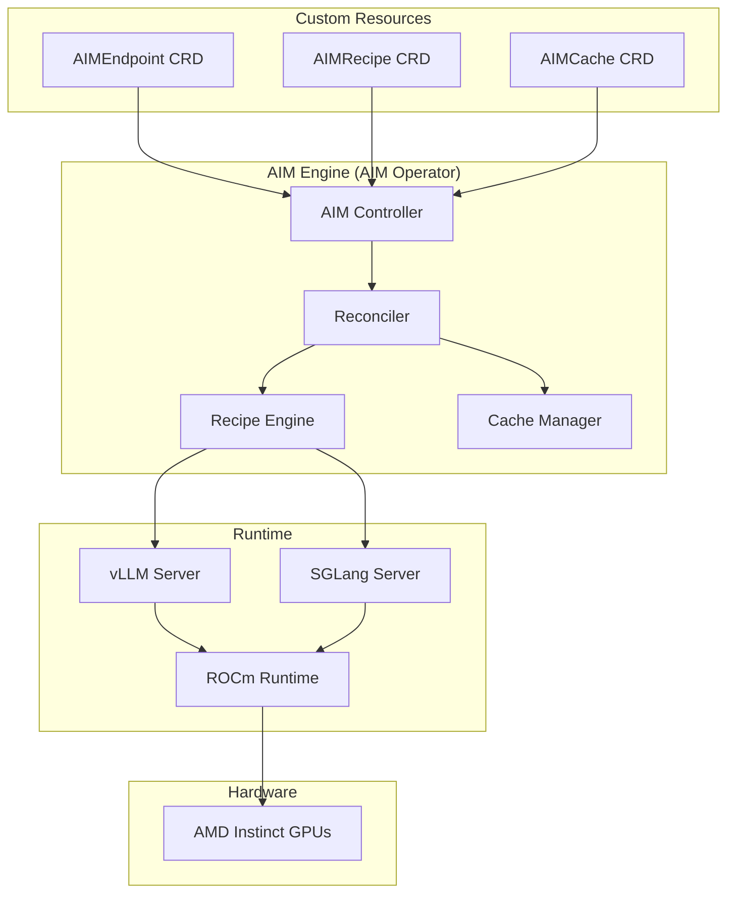
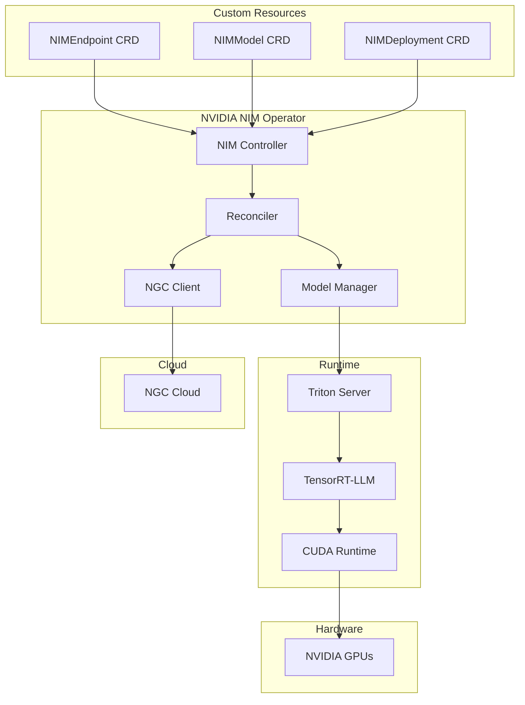

# AIM Engine (AIM Operator) vs NVIDIA NIM Operator: Comprehensive Comparison

## **Executive Summary**

| Aspect | AIM Engine (AIM Operator) | NVIDIA NIM Operator |
|--------|-------------------|-------------------|
| **Hardware Focus** | AMD Instinct™ GPUs (MI300X, MI325X, MI355X) | NVIDIA GPUs (H100, A100, L40S, RTX) |
| **Architecture** | Kubernetes Operator with Custom CRDs | Kubernetes Operator with Custom CRDs |
| **Model Support** | Open-source models (HuggingFace) | NVIDIA-curated models + custom models |
| **Deployment Model** | Self-hosted, on-premises | Cloud-native, hybrid (self-hosted + NGC) |
| **Cost Model** | Open-source, no licensing fees | Commercial licensing + NGC subscription |
| **Customization** | Full recipe customization | Limited customization, NVIDIA-curated |

---

## **Detailed Comparison**

### **1. Hardware & Platform Support**

#### **AIM Engine (AIM Operator)**
- **Target Hardware**: AMD Instinct™ GPUs
  - MI300X (192GB HBM3)
  - MI325X (192GB HBM3)
  - MI355X (192GB HBM3)
- **Software Stack**: ROCm, vLLM, SGLang
- **Deployment**: On-premises, self-hosted
- **Cloud Support**: Limited (Azure and some NeoClouds with AMD instances)

#### **NVIDIA NIM Operator**
- **Target Hardware**: NVIDIA GPUs
  - H100 (80GB HBM3)
  - A100 (40GB/80GB HBM2e)
  - L40S (48GB GDDR6)
  - RTX 4090/4080 (24GB GDDR6X)
- **Software Stack**: CUDA, TensorRT-LLM, Triton
- **Deployment**: Hybrid (self-hosted + NGC cloud)
- **Cloud Support**: Extensive (AWS, Azure, GCP, NGC)

### **2. Model Ecosystem**

#### **AIM Engine (AIM Operator)**

**Advantages:**
- ✅ **Open-source models**: Full access to HuggingFace ecosystem
- ✅ **Custom models**: Any model that works with vLLM/SGLang
- ✅ **No licensing fees**: Free to use any open-weight model
- ✅ **Community-driven**: Rapid adoption of new models

**Limitations:**
- ❌ **Performance variability**: Depends on community optimization

#### **NVIDIA NIM Operator**

**Advantages:**
- ✅ **Pre-optimized models**: NVIDIA-tested and optimized
- ✅ **Performance guarantees**: Consistent, validated performance
- ✅ **Enterprise support**: NVIDIA-backed reliability
- ✅ **NGC integration**: Seamless cloud deployment

**Limitations:**
- ❌ **Licensing costs**: Commercial licensing required
- ❌ **Vendor lock-in**: Tied to NVIDIA ecosystem

### **3. Architecture & Design**

#### **AIM Engine (AIM Operator) Architecture**


**Key Features:**
- **Recipe-based optimization**: Intelligent configuration selection
- **Multi-backend support**: vLLM, SGLang, extensible
- **Hardware detection**: Automatic GPU detection and optimization
- **Cache management**: Persistent model caching
- **Custom CRDs**: AIMEndpoint, AIMRecipe, AIMCache

#### **NVIDIA NIM Operator Architecture**


**Key Features:**
- **NGC integration**: Cloud-native model management
- **TensorRT optimization**: Hardware-specific optimizations
- **Triton server**: Production inference server
- **Model versioning**: NGC model registry integration
- **Enterprise features**: RBAC, monitoring, security

### **5. Deployment & Operations**

#### **AIM Engine (AIM Operator) Deployment**
```bash
# Self-hosted deployment
git clone https://github.com/aim-engine/operator
cd operator

# Build and deploy
make docker-build
make deploy

# Create endpoint
kubectl apply -f examples/aimendpoint.yaml
```

**Deployment Model:**
- **Self-hosted**: Full control over infrastructure
- **On-premises**: Data sovereignty and security
- **Open-source**: Easy to integrate with an open ecosystem
- **Customizable**: Full recipe customization

**Operational Features:**
- **Recipe management**: Custom optimization recipes
- **Cache control**: Persistent model storage
- **Monitoring**: Prometheus/Grafana integration
- **Scaling**: Horizontal Pod Autoscaler
- **Security**: RBAC, network policies

#### **NVIDIA NIM Operator Deployment**
```bash
# NGC deployment
helm repo add nvidia-nim https://helm.ngc.nvidia.com/nim
helm repo update

# Install operator
helm install nim-operator nvidia-nim/nim-operator \
  --namespace nim-system \
  --create-namespace

# Deploy model
kubectl apply -f examples/nim-deployment.yaml
```

**Deployment Model:**
- **Hybrid**: Self-hosted + NGC cloud
- **NGC integration**: Cloud-native model management
- **Enterprise**: NVIDIA support and SLAs
- **Managed**: NGC handles model optimization

**Operational Features:**
- **NGC registry**: Centralized model management
- **Model versioning**: NGC model registry
- **Monitoring**: NVIDIA monitoring stack
- **Scaling**: Kubernetes-native scaling
- **Security**: Enterprise-grade security

### **6. Cost & Licensing**

#### **AIM Engine (AIM Operator)**
```yaml
cost_structure:
  licensing:
    - "Open-source (Apache 2.0)"
    - "No licensing fees"
    - "No vendor lock-in"
  
  hardware:
    - "AMD Instinct GPUs"
    - "Competitive pricing"
    - "High memory capacity"
  
  operational:
    - "Self-managed infrastructure"
    - "Custom optimization required"
    - "Community support"
```

**Cost Advantages:**
- ✅ **No licensing fees**: Completely open-source
- ✅ **Hardware flexibility**: Choice of AMD GPUs
- ✅ **Infrastructure control**: Self-hosted cost control
- ✅ **Community support**: Free community resources

**Cost Considerations:**
- ❌ **Optimization effort**: Manual performance tuning
- ❌ **Support costs**: Self-managed or community support
- ❌ **Infrastructure management**: Operational overhead

#### **NVIDIA NIM Operator**
```yaml
cost_structure:
  licensing:
    - "Commercial licensing"
    - "NGC subscription fees"
    - "Enterprise support costs"
  
  hardware:
    - "NVIDIA GPUs"
    - "Premium pricing"
    - "Optimized performance"
  
  operational:
    - "NGC managed services"
    - "Pre-optimized models"
    - "Enterprise support"
```

**Cost Advantages:**
- ✅ **Pre-optimized**: Reduced optimization effort
- ✅ **Enterprise support**: Professional support
- ✅ **NGC integration**: Managed model lifecycle
- ✅ **Performance guarantees**: Validated performance

**Cost Considerations:**
- ❌ **Licensing fees**: Commercial licensing required
- ❌ **Vendor lock-in**: Tied to NVIDIA ecosystem
- ❌ **Subscription costs**: Ongoing NGC fees
- ❌ **Hardware premium**: NVIDIA GPU pricing

### **7. Use Cases & Target Markets**

#### **AIM Engine (AIM Operator) Use Cases**
```yaml
target_markets:
  - "Research institutions"
  - "Open-source communities"
  - "Cost-conscious enterprises"
  - "AMD hardware users"
  - "Data sovereignty requirements"

use_cases:
  - "Academic research"
  - "Open-source model serving"
  - "Custom model deployment"
  - "On-premises AI infrastructure"
  - "Multi-tenant AI platforms"
```

**Ideal For:**
- **Research & Development**: Open-source model experimentation
- **Cost Optimization**: Budget-conscious deployments
- **Custom Models**: Proprietary or specialized models
- **Data Sovereignty**: On-premises requirements
- **AMD Hardware**: Existing AMD infrastructure

#### **NVIDIA NIM Operator Use Cases**
```yaml
target_markets:
  - "Enterprise customers"
  - "Production deployments"
  - "NVIDIA hardware users"
  - "Cloud-native organizations"
  - "Performance-critical applications"

use_cases:
  - "Enterprise AI platforms"
  - "Production model serving"
  - "High-performance inference"
  - "Cloud-native AI services"
  - "Multi-cloud deployments"
```

**Ideal For:**
- **Enterprise Production**: High-reliability requirements
- **Performance-Critical**: Maximum performance needs
- **Cloud-Native**: NGC integration requirements
- **NVIDIA Hardware**: Existing NVIDIA infrastructure
- **Managed Services**: Reduced operational overhead

### **8. Feature Comparison Matrix**

| Feature | AIM Engine (AIM Operator) | NVIDIA NIM Operator |
|---------|-------------------|-------------------|
| **Hardware Support** | AMD Instinct GPUs | NVIDIA GPUs |
| **Model Ecosystem** | Open-source (HuggingFace) | NVIDIA-curated + custom |
| **Licensing** | Open-source (Apache 2.0) | Commercial licensing |
| **Deployment** | Self-hosted, on-premises | Hybrid (self-hosted + NGC) |
| **Optimization** | Recipe-based, manual | Pre-optimized, automated |
| **Performance** | Community-optimized | NVIDIA-validated |
| **Cost** | Free licensing, hardware costs | Licensing + subscription fees |
| **Support** | Community, self-managed | Enterprise, NVIDIA support |
| **Customization** | Full recipe customization | Limited, NVIDIA-curated |
| **Integration** | vLLM, SGLang, ROCm | TensorRT-LLM, Triton, CUDA |
| **Monitoring** | Prometheus/Grafana | NVIDIA monitoring stack |
| **Scaling** | Kubernetes HPA | Kubernetes-native scaling |
| **Security** | RBAC, network policies | Enterprise security features |
| **Multi-GPU** | Tensor parallelism | Tensor + pipeline parallelism |
| **Quantization** | bfloat16, float16, float8 | INT8, FP8, mixed precision |

### **9. Migration & Interoperability**

#### **Migrating from NVIDIA NIM Operator to AIM Engine (AIM Operator)**
```yaml
migration_challenges:
  - "Hardware replacement (NVIDIA → AMD)"
  - "Model re-optimization"
  - "Recipe development"
  - "Performance validation"
  - "Support transition"

migration_steps:
  1: "Hardware assessment and procurement"
  2: "Model compatibility testing"
  3: "Recipe development and optimization"
  4: "Gradual migration strategy"
  5: "Validation and optimization"
```

### **10. Future Roadmap & Evolution**

#### **AIM Engine (AIM Operator) Roadmap**
```yaml
phase_1_current:
  - "Core operator functionality"
  - "Recipe-based optimization"
  - "Multi-GPU support"
  - "Basic monitoring"

phase_2_next:
  - "Advanced recipe engine"
  - "Multi-model deployment"
  - "Advanced monitoring"
  - "Cloud integration"

phase_3_future:
  - "Federated learning support"
  - "Edge deployment"
  - "AutoML integration"
  - "Enterprise features"
```

#### **NVIDIA NIM Operator Roadmap**
```yaml
phase_1_current:
  - "NGC integration"
  - "Pre-optimized models"
  - "Enterprise features"
  - "Cloud-native deployment"

phase_2_next:
  - "Advanced model optimization"
  - "Multi-cloud support"
  - "Edge deployment"
  - "AutoML integration"

phase_3_future:
  - "Federated learning"
  - "Quantum computing integration"
  - "Advanced security features"
  - "Global model marketplace"
```

---

## **Recommendations**

### **Choose AIM Engine (AIM Operator) When:**
- ✅ **Cost optimization** is a priority
- ✅ **Open-source models** are required
- ✅ **AMD hardware** is available
- ✅ **Custom optimization** is needed
- ✅ **Data sovereignty** is required
- ✅ **Vendor independence** is important

### **Choose NVIDIA NIM Operator When:**
- ✅ **Enterprise production** deployment
- ✅ **Maximum performance** is critical
- ✅ **NVIDIA hardware** is available
- ✅ **Pre-optimized models** are preferred
- ✅ **Enterprise support** is required
- ✅ **NGC integration** is beneficial

### **Hybrid Approach:**
Consider using both operators in different environments:
- **Development/Testing**: AIM Engine (AIM Operator) (cost-effective)
- **Production**: NVIDIA NIM Operator (performance-optimized)
- **Research**: AIM Engine (AIM Operator) (open-source flexibility)
- **Enterprise**: NVIDIA NIM Operator (enterprise features)

---

## **Conclusion**

Both AIM Engine (AIM Operator) and NVIDIA NIM Operator provide robust Kubernetes-native solutions for AI model deployment, but they target different market segments and use cases:

- **AIM Engine (AIM Operator)** excels in cost-effectiveness, open-source flexibility, and AMD hardware optimization
- **NVIDIA NIM Operator** excels in performance, enterprise features, and NVIDIA ecosystem integration

The choice between them depends on your specific requirements, hardware constraints, budget considerations, and performance needs. Both operators represent the future of Kubernetes-native AI model deployment, each with their unique strengths and target markets. 
