# AIM Engine Architecture Diagrams

## 🏗️ **System Architecture Diagrams**

### **1. High-Level System Architecture**

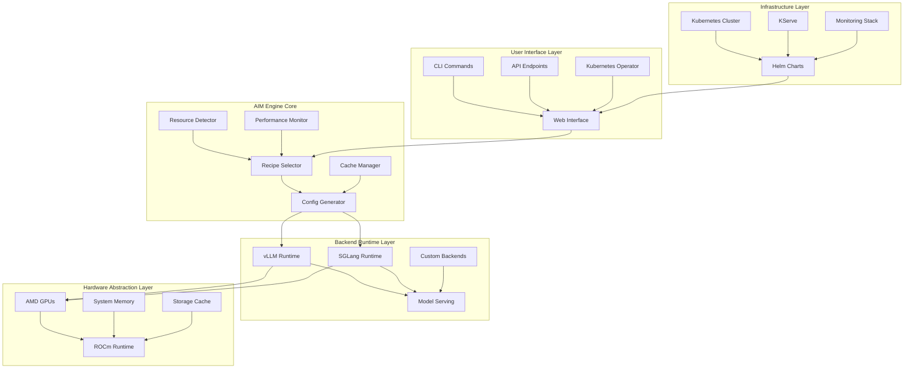

### **2. Container Architecture**

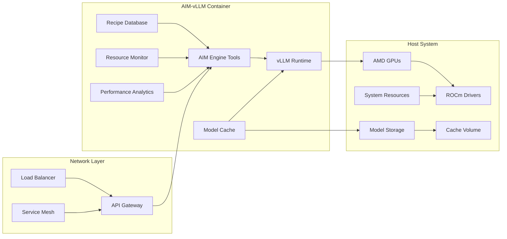

### **3. Data Flow Architecture**

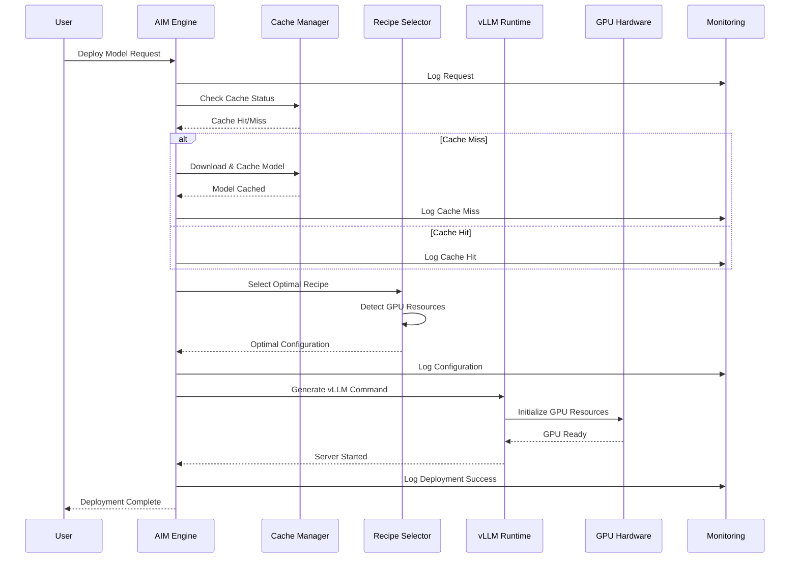

### **4. Cache Architecture**

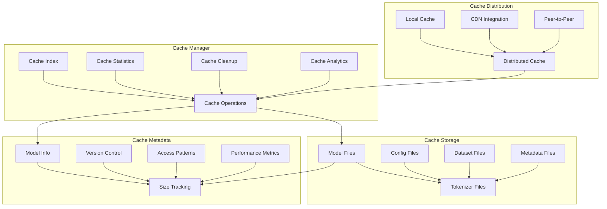

### **5. Recipe Selection Flow**

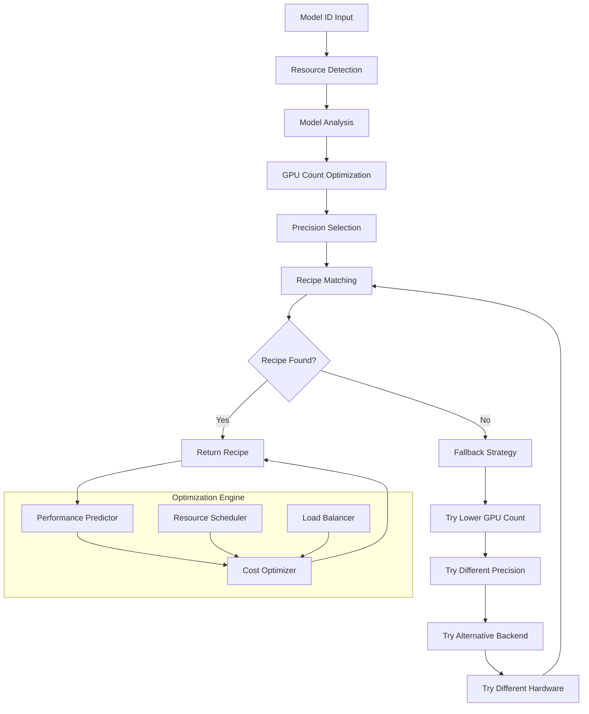

### **6. Kubernetes Deployment Architecture**

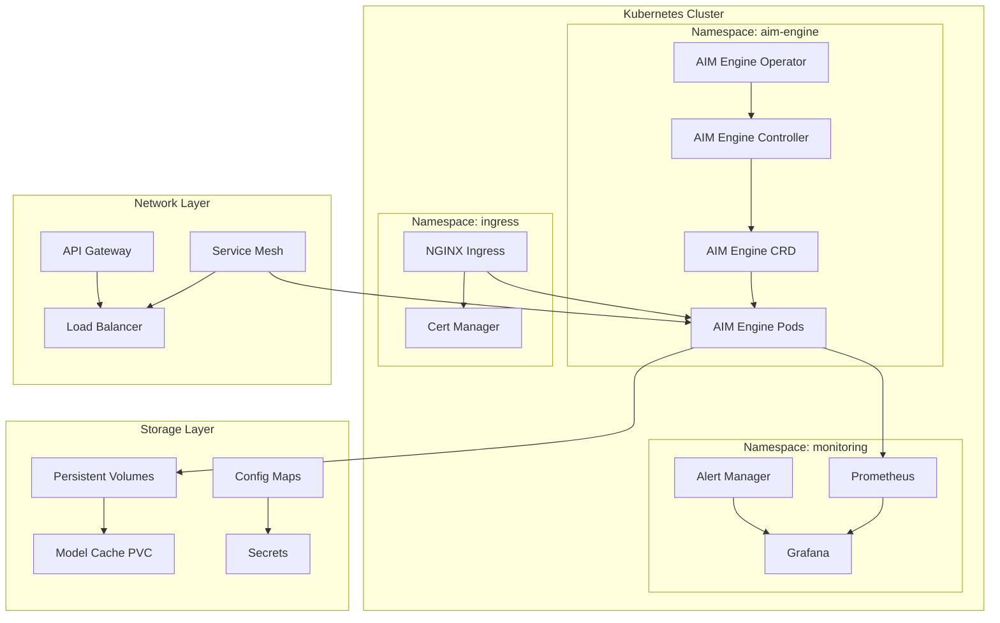

### **7. Performance Monitoring Architecture**

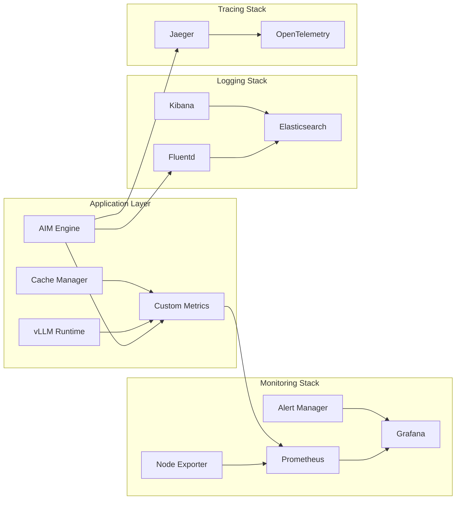

### **8. Security Architecture**

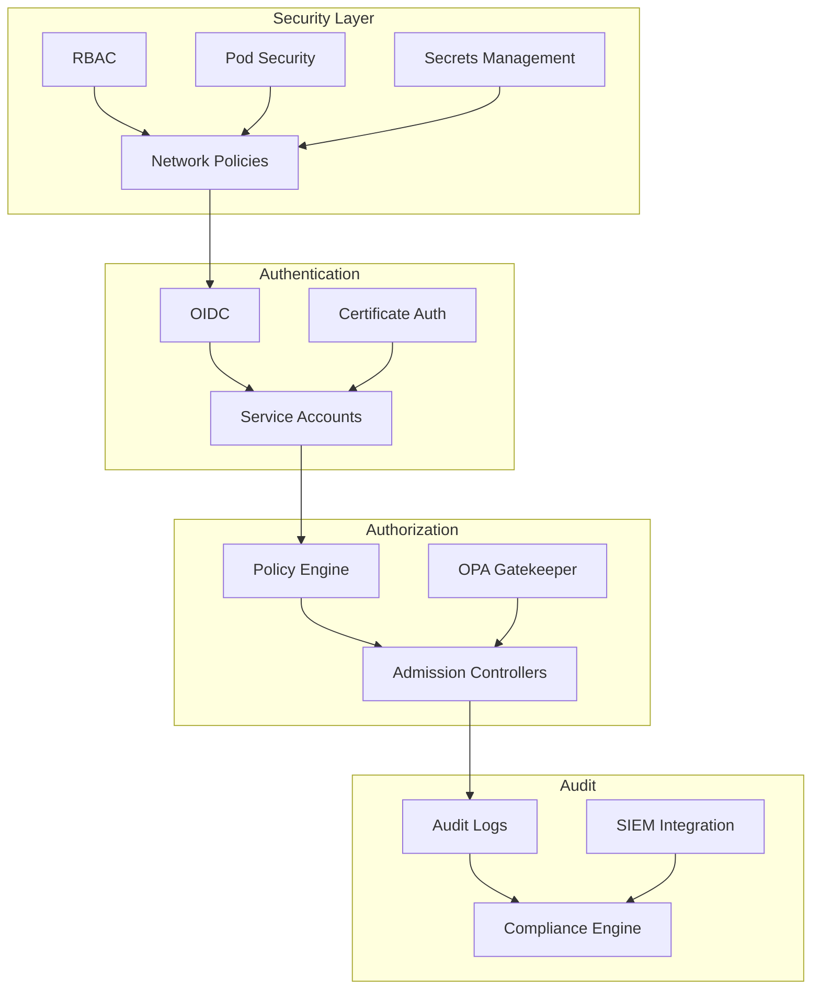

### **9. Scalability Architecture**

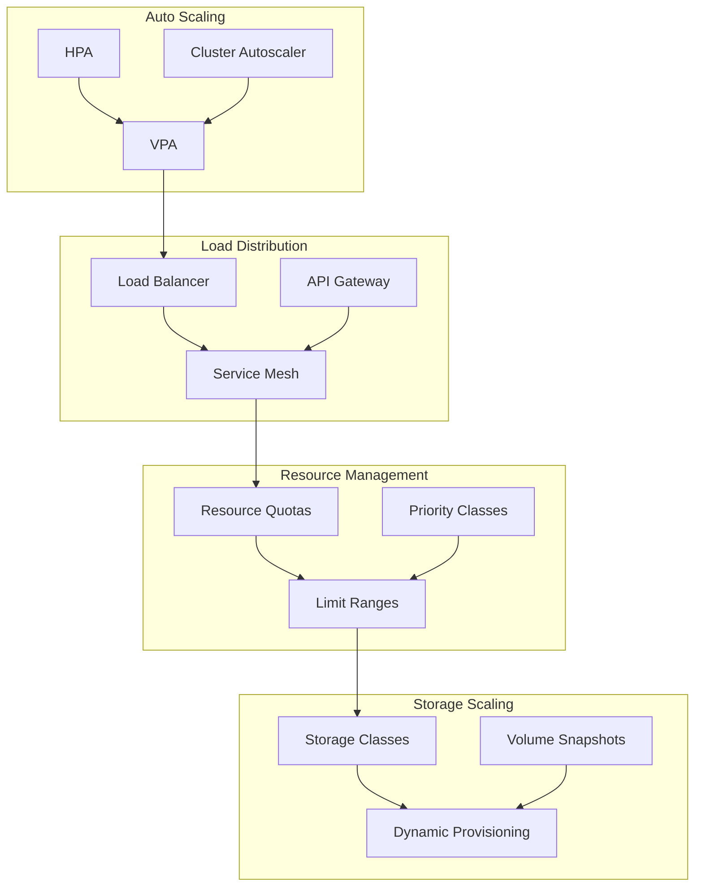

### **10. Disaster Recovery Architecture**

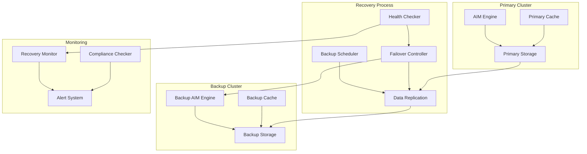

## 📊 **Performance Architecture**

### **Throughput Optimization**

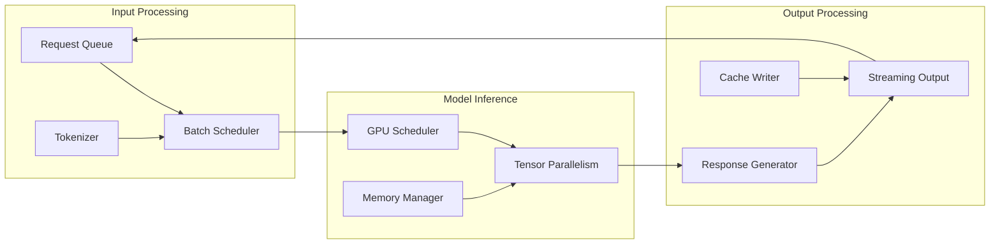

### **Memory Management**

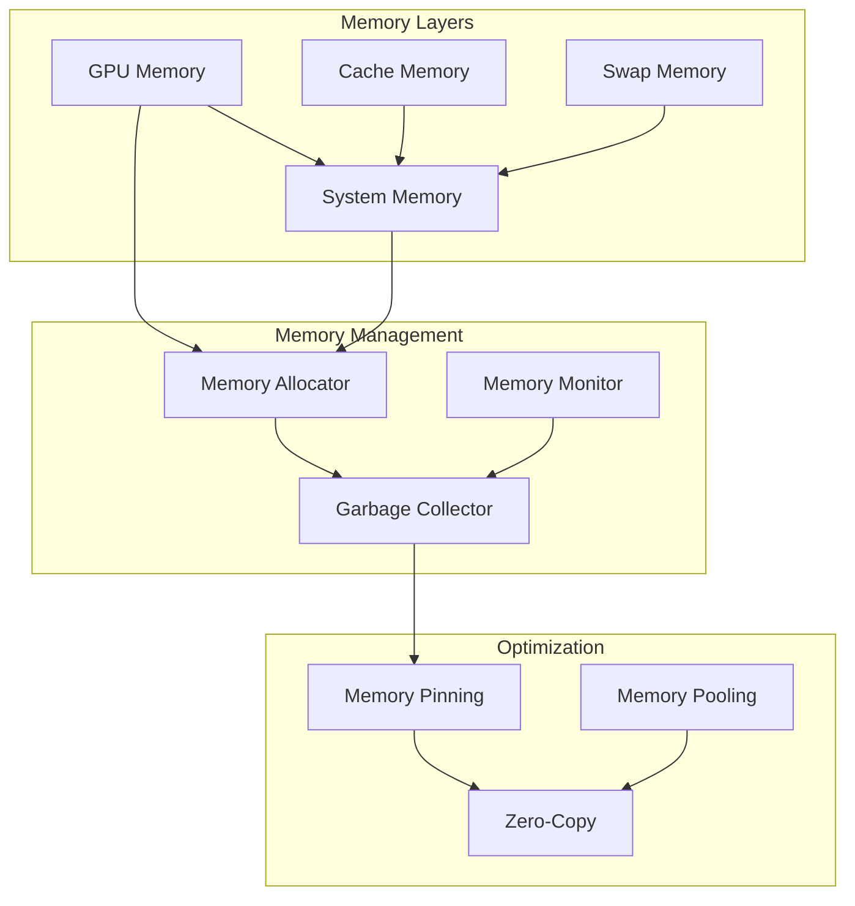

## 🔄 **Deployment Workflows**

### **Standard Deployment Flow**

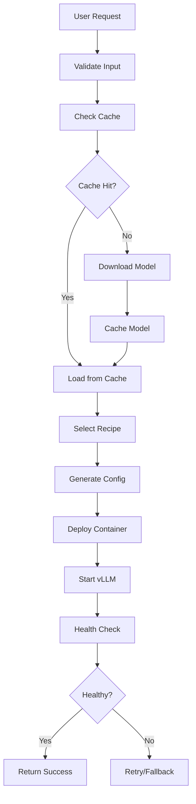

### **Kubernetes Deployment Flow**

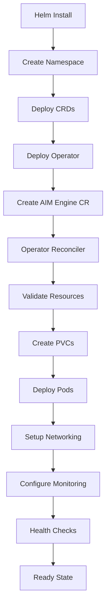

## 📈 **Monitoring Architecture**

### **Metrics Collection**

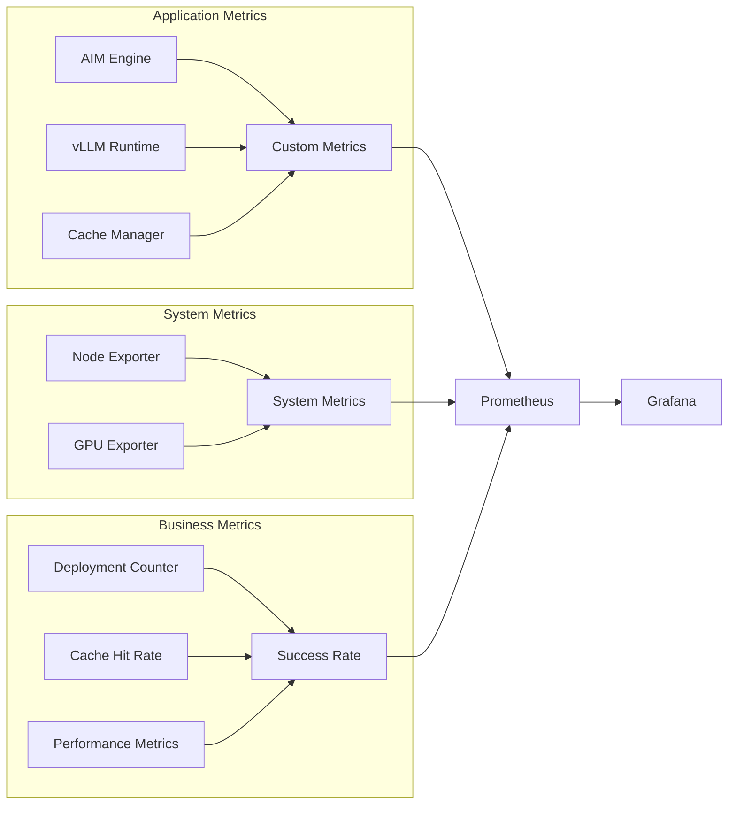

### **Alerting Architecture**

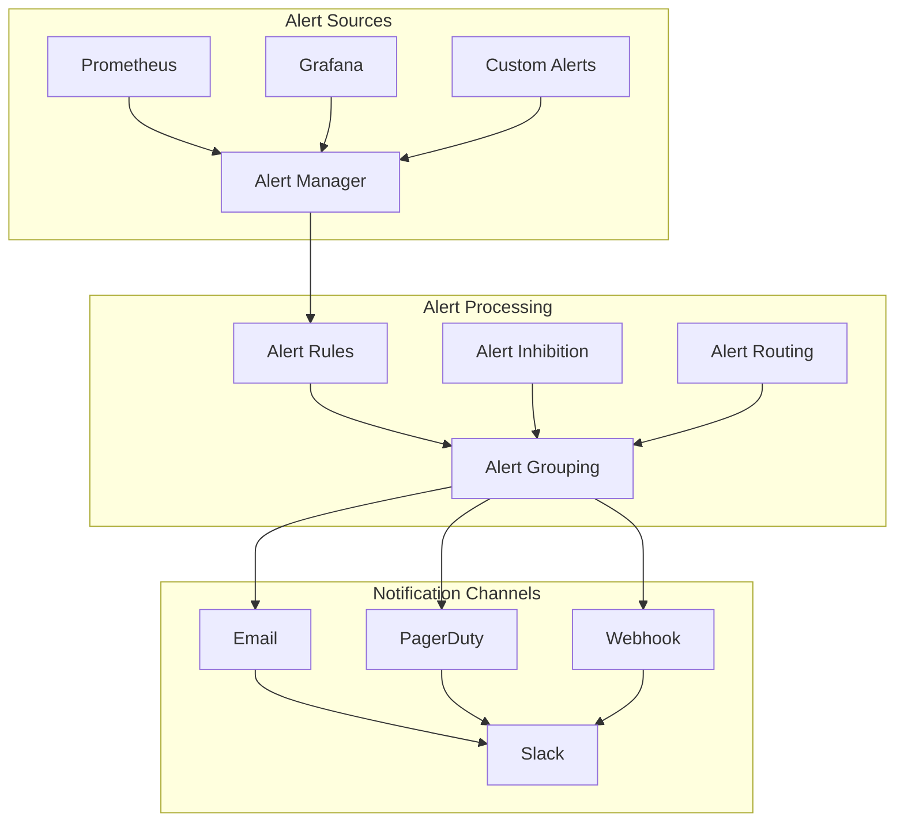

---

*These diagrams provide a comprehensive view of the AIM Engine architecture, from high-level system design to detailed component interactions and deployment workflows.* 