# AIM Engine Kubernetes Deployment Architecture

## **System Architecture Overview**

```mermaid
graph TB
    %% User/Admin
    User[👤 User/Admin]
    
    %% External Systems
    Internet[🌐 Internet]
    ModelRegistry[HuggingFace Model Registry]
    
    %% Local Infrastructure
    subgraph "Local Node"
        subgraph "Docker Layer"
            LocalRegistry[📦 Local Registry<br/>localhost:5000]
            AIMImage[🐳 AIM Engine Image<br/>aim-vllm:latest]
        end
        
        subgraph "Kubernetes Cluster"
            subgraph "System Components"
                KubeAPI[🔌 Kubernetes API Server]
                KubeScheduler[📅 Scheduler]
                KubeController[🎛️ Controller Manager]
                Etcd[💾 etcd]
            end
            
            subgraph "Network Layer"
                Calico[🌐 Calico CNI]
                CoreDNS[🔍 CoreDNS]
            end
            
            subgraph "Storage Layer"
                LocalStorage[💿 Local Path Provisioner]
                ModelCache[📁 Model Cache PVC]
            end
            
            subgraph "GPU Layer"
                AMDGPUPlugin[🎮 AMD GPU Device Plugin]
                ROCm[⚡ ROCm Runtime]
            end
            
            subgraph "Monitoring Layer"
                MetricsServer[📊 Metrics Server]
                Prometheus[📈 Prometheus]
                Grafana[📊 Grafana]
            end
            
            subgraph "AIM Engine Namespace"
                subgraph "Recipe System"
                    RecipeSelector[🎯 Recipe Selector Job]
                    RecipeValidator[✅ Admission Controller]
                    RecipeConfig[⚙️ Recipe ConfigMap]
                end
                
                subgraph "Core Application"
                    AIMDeployment[🚀 AIM Engine Deployment]
                    AIMService[🔗 NodePort Service]
                    AIMPod[📦 AIM Engine Pod]
                end
                
                subgraph "Application Components"
                    vLLM[vLLM Server]
                    RecipeEngine[Recipe Engine]
                    Monitoring[Custom Metrics]
                end
            end
        end
    end
    
    %% External Access
    ExternalClient[💻 External Client]
    
    %% Connections - Setup Flow
    User -->|1. Setup Script| LocalRegistry
    User -->|2. Build Image| AIMImage
    User -->|3. Deploy| KubeAPI
    
    %% Connections - Image Flow
    AIMImage -->|Push| LocalRegistry
    LocalRegistry -->|Pull| AIMPod
    
    %% Connections - Model Flow
    Internet -->|Download Models| ModelRegistry
    ModelRegistry -->|Cache| ModelCache
    ModelCache -->|Mount| AIMPod
    
    %% Connections - Kubernetes Flow
    KubeAPI --> KubeScheduler
    KubeScheduler --> AIMDeployment
    AIMDeployment --> AIMPod
    KubeAPI --> Etcd
    
    %% Connections - Network Flow
    Calico --> AIMPod
    CoreDNS --> AIMPod
    AIMService --> AIMPod
    
    %% Connections - Storage Flow
    LocalStorage --> ModelCache
    ModelCache --> AIMPod
    
    %% Connections - GPU Flow
    AMDGPUPlugin --> AIMPod
    ROCm --> AIMPod
    
    %% Connections - Monitoring Flow
    MetricsServer --> AIMPod
    Prometheus --> Monitoring
    Grafana --> Prometheus
    
    %% Connections - Recipe Flow
    RecipeSelector --> RecipeConfig
    RecipeValidator --> AIMDeployment
    RecipeConfig --> AIMPod
    
    %% Connections - Application Flow
    AIMPod --> vLLM
    AIMPod --> RecipeEngine
    AIMPod --> Monitoring
    
    %% External Access Flow
    ExternalClient -->|HTTP Request| AIMService
    AIMService -->|Port Forward| AIMPod
    
    %% Styling
    classDef userClass fill:#e1f5fe,stroke:#01579b,stroke-width:2px
    classDef systemClass fill:#f3e5f5,stroke:#4a148c,stroke-width:2px
    classDef appClass fill:#e8f5e8,stroke:#1b5e20,stroke-width:2px
    classDef infraClass fill:#fff3e0,stroke:#e65100,stroke-width:2px
    classDef monitoringClass fill:#fce4ec,stroke:#880e4f,stroke-width:2px
    
    class User,ExternalClient userClass
    class KubeAPI,KubeScheduler,KubeController,Etcd,Calico,CoreDNS,LocalStorage,AMDGPUPlugin,ROCm systemClass
    class AIMDeployment,AIMService,AIMPod,vLLM,RecipeEngine,RecipeSelector,RecipeValidator,RecipeConfig appClass
    class LocalRegistry,AIMImage,ModelCache,ModelRegistry,Internet infraClass
    class MetricsServer,Prometheus,Grafana,Monitoring monitoringClass
```

## **Deployment Flow**

## **Recipe Selection Flow**

## **Resource Allocation**

```mermaid
graph LR
    subgraph "Hardware Resources"
        GPU[🎮 AMD GPUs<br/>MI300X/MI325X]
        CPU[🖥️ CPU Cores<br/>4-32 cores]
        Memory[💾 RAM<br/>16-512GB]
        Storage[💿 Storage<br/>50GB-1TB]
    end
    
    subgraph "Kubernetes Resources"
        GPUResource[amd.com/gpu<br/>1-8 GPUs]
        CPUResource[cpu<br/>4-32 cores]
        MemoryResource[memory<br/>16-512Gi]
        StorageResource[storage<br/>50Gi-1Ti]
    end
    
    subgraph "AIM Engine Pod"
        GPULimit[GPU Limit<br/>Based on Recipe]
        CPURequest[CPU Request<br/>Based on Model]
        MemoryLimit[Memory Limit<br/>Based on Model Size]
        ModelCache[Model Cache<br/>Persistent Storage]
    end
    
    GPU --> GPUResource
    CPU --> CPUResource
    Memory --> MemoryResource
    Storage --> StorageResource
    
    GPUResource --> GPULimit
    CPUResource --> CPURequest
    MemoryResource --> MemoryLimit
    StorageResource --> ModelCache
```

## **Monitoring Architecture**

## **Network Architecture**

## **Deployment States**

## **Cleanup Flow**

## **Usage Examples**

These diagrams provide a comprehensive view of the AIM Engine Kubernetes deployment architecture, from initial setup through monitoring and cleanup. 