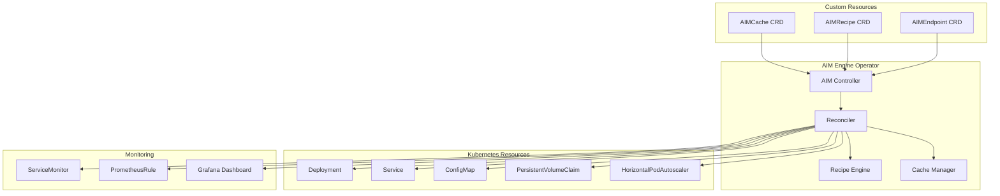

# AIM Engine Kubernetes Operator

A production-grade Kubernetes operator that manages the complete lifecycle of AIM Engine endpoints with intelligent recipe selection, automatic scaling, and comprehensive monitoring.

## **Overview**

The AIM Engine Operator extends Kubernetes with custom resources to declaratively manage AI model deployments on AMD hardware. It provides:

- **Declarative Configuration**: Define AIM endpoints using Custom Resource Definitions (CRDs)
- **Intelligent Recipe Selection**: Automatic optimization based on hardware and model requirements
- **Lifecycle Management**: Automatic deployment, scaling, updates, and cleanup
- **Production Monitoring**: Built-in metrics, health checks, and alerting
- **Multi-Model Support**: Manage multiple models with different configurations

## **Architecture**



## **Custom Resource Definitions**

### **AIMEndpoint**

The primary resource for defining AIM model endpoints:

```yaml
apiVersion: aim.engine.amd.com/v1alpha1
kind: AIMEndpoint
metadata:
  name: qwen-32b-production
  namespace: aim-engine
spec:
  model:
    id: "Qwen/Qwen3-32B"
    version: "latest"
  
  # Recipe selection
  recipe:
    autoSelect: true  # Let operator select optimal recipe
    # OR manual selection:
    # autoSelect: false
    # gpuCount: 4
    # precision: "bfloat16"
    # backend: "vllm"
  
  # Resource configuration
  resources:
    gpuCount: 4  # Override auto-selection if needed
    memory: "64Gi"
    cpu: "16"
  
  # Scaling configuration
  scaling:
    minReplicas: 1
    maxReplicas: 5
    targetCPUUtilization: 70
    targetMemoryUtilization: 80
  
  # Service configuration
  service:
    type: LoadBalancer
    port: 8000
    annotations:
      service.beta.kubernetes.io/aws-load-balancer-type: nlb
  
  # Monitoring
  monitoring:
    enabled: true
    prometheus:
      enabled: true
      interval: 30s
    grafana:
      enabled: true
      dashboard: "aim-endpoint-dashboard"
  
  # Cache configuration
  cache:
    enabled: true
    storageClass: "fast-ssd"
    size: "100Gi"
  
  # Security
  security:
    serviceAccount:
      create: true
      name: "aim-endpoint-sa"
    podSecurityContext:
      runAsUser: 0
      runAsGroup: 0
      fsGroup: 0
```

### **AIMRecipe**

Define custom recipes for specific hardware configurations:

```yaml
apiVersion: aim.engine.amd.com/v1alpha1
kind: AIMRecipe
metadata:
  name: qwen-32b-mi300x-bf16
  namespace: aim-engine
spec:
  modelId: "Qwen/Qwen3-32B"
  hardware: "MI300X"
  precision: "bfloat16"
  backend: "vllm"
  
  configurations:
    - gpuCount: 1
      enabled: true
      args:
        - "--model"
        - "Qwen/Qwen3-32B"
        - "--dtype"
        - "bfloat16"
        - "--max-model-len"
        - "32768"
        - "--gpu-memory-utilization"
        - "0.9"
        - "--trust-remote-code"
        - "true"
        - "--port"
        - "8000"
      resources:
        requests:
          amd.com/gpu: "1"
          memory: "32Gi"
          cpu: "4"
        limits:
          amd.com/gpu: "1"
          memory: "64Gi"
          cpu: "8"
    
    - gpuCount: 4
      enabled: true
      args:
        - "--model"
        - "Qwen/Qwen3-32B"
        - "--dtype"
        - "bfloat16"
        - "--tensor-parallel-size"
        - "4"
        - "--max-model-len"
        - "32768"
        - "--gpu-memory-utilization"
        - "0.9"
        - "--trust-remote-code"
        - "true"
        - "--port"
        - "8000"
      resources:
        requests:
          amd.com/gpu: "4"
          memory: "64Gi"
          cpu: "16"
        limits:
          amd.com/gpu: "4"
          memory: "128Gi"
          cpu: "32"
  
  performance:
    expectedTokensPerSecond: 5000
    expectedLatencyMs: 100
    maxBatchSize: 32
```

### **AIMCache**

Manage model caching across endpoints:

```yaml
apiVersion: aim.engine.amd.com/v1alpha1
kind: AIMCache
metadata:
  name: global-model-cache
  namespace: aim-engine
spec:
  storage:
    storageClass: "fast-ssd"
    size: "500Gi"
    accessMode: ReadWriteMany
  
  models:
    - id: "Qwen/Qwen3-32B"
      priority: high
      retention: 30d
    - id: "Qwen/Qwen2.5-7B-Instruct"
      priority: medium
      retention: 7d
  
  cleanup:
    enabled: true
    schedule: "0 2 * * *"  # Daily at 2 AM
    maxAge: 30d
    minFreeSpace: "100Gi"
```

## **Installation**

### **Prerequisites**

- Kubernetes cluster 1.24+
- AMD GPU nodes with ROCm support
- Helm 3.0+
- kubectl configured

### **Install Operator**

```bash
# Add the AIM Engine operator repository
helm repo add aim-engine-operator https://aim-engine.github.io/operator
helm repo update

# Install the operator
helm install aim-engine-operator aim-engine-operator/aim-engine-operator \
  --namespace aim-engine-operator \
  --create-namespace \
  --set image.repository=localhost:5000/aim-engine-operator \
  --set image.tag=latest
```

### **Verify Installation**

```bash
# Check operator deployment
kubectl get pods -n aim-engine-operator

# Check CRDs
kubectl get crd | grep aim.engine.amd.com

# Check operator logs
kubectl logs -f deployment/aim-engine-operator -n aim-engine-operator
```

## **Usage Examples**

### **Basic Endpoint Deployment**

```bash
# Create a basic endpoint
cat << EOF | kubectl apply -f -
apiVersion: aim.engine.amd.com/v1alpha1
kind: AIMEndpoint
metadata:
  name: qwen-7b-demo
  namespace: aim-engine
spec:
  model:
    id: "Qwen/Qwen2.5-7B-Instruct"
  recipe:
    autoSelect: true
  service:
    type: NodePort
EOF
```

### **Production Endpoint with Custom Recipe**

```bash
# Create custom recipe
cat << EOF | kubectl apply -f -
apiVersion: aim.engine.amd.com/v1alpha1
kind: AIMRecipe
metadata:
  name: qwen-32b-production
  namespace: aim-engine
spec:
  modelId: "Qwen/Qwen3-32B"
  hardware: "MI300X"
  precision: "bfloat16"
  backend: "vllm"
  configurations:
    - gpuCount: 4
      enabled: true
      args:
        - "--model"
        - "Qwen/Qwen3-32B"
        - "--dtype"
        - "bfloat16"
        - "--tensor-parallel-size"
        - "4"
        - "--max-model-len"
        - "32768"
        - "--gpu-memory-utilization"
        - "0.9"
      resources:
        requests:
          amd.com/gpu: "4"
          memory: "64Gi"
          cpu: "16"
        limits:
          amd.com/gpu: "4"
          memory: "128Gi"
          cpu: "32"
EOF

# Create endpoint using custom recipe
cat << EOF | kubectl apply -f -
apiVersion: aim.engine.amd.com/v1alpha1
kind: AIMEndpoint
metadata:
  name: qwen-32b-production
  namespace: aim-engine
spec:
  model:
    id: "Qwen/Qwen3-32B"
  recipe:
    autoSelect: false
    gpuCount: 4
    precision: "bfloat16"
    backend: "vllm"
  scaling:
    minReplicas: 2
    maxReplicas: 5
    targetCPUUtilization: 70
  service:
    type: LoadBalancer
  monitoring:
    enabled: true
EOF
```

### **Multi-Model Deployment**

```bash
# Deploy multiple models
kubectl apply -f - << EOF
---
apiVersion: aim.engine.amd.com/v1alpha1
kind: AIMEndpoint
metadata:
  name: qwen-7b-chat
  namespace: aim-engine
spec:
  model:
    id: "Qwen/Qwen2.5-7B-Instruct"
  recipe:
    autoSelect: true
  service:
    type: ClusterIP
    port: 8000
---
apiVersion: aim.engine.amd.com/v1alpha1
kind: AIMEndpoint
metadata:
  name: qwen-32b-inference
  namespace: aim-engine
spec:
  model:
    id: "Qwen/Qwen3-32B"
  recipe:
    autoSelect: true
  service:
    type: ClusterIP
    port: 8000
EOF
```

## **Monitoring and Observability**

### **Built-in Metrics**

The operator automatically creates ServiceMonitor and PrometheusRule resources:

```yaml
# ServiceMonitor for endpoint metrics
apiVersion: monitoring.coreos.com/v1
kind: ServiceMonitor
metadata:
  name: aim-endpoint-monitor
  namespace: aim-engine
spec:
  selector:
    matchLabels:
      app.kubernetes.io/name: aim-endpoint
  endpoints:
  - port: http
    interval: 30s
    path: /metrics
```

### **Grafana Dashboards**

Pre-configured dashboards for:
- Endpoint performance metrics
- GPU utilization
- Model inference latency
- Resource consumption
- Recipe selection analytics

### **Alerts**

Automatic alerting for:
- High latency (> 500ms)
- Low GPU utilization (< 50%)
- Memory pressure
- Pod restarts
- Recipe selection failures

## **Advanced Features**

### **Automatic Scaling**

```yaml
apiVersion: aim.engine.amd.com/v1alpha1
kind: AIMEndpoint
metadata:
  name: auto-scaling-endpoint
spec:
  # ... other config
  scaling:
    minReplicas: 1
    maxReplicas: 10
    targetCPUUtilization: 70
    targetMemoryUtilization: 80
    targetGPUUtilization: 85
    scaleDownDelay: 300s
    scaleUpDelay: 60s
```

### **Canary Deployments**

```yaml
apiVersion: aim.engine.amd.com/v1alpha1
kind: AIMEndpoint
metadata:
  name: canary-endpoint
spec:
  # ... other config
  deployment:
    strategy:
      type: RollingUpdate
      rollingUpdate:
        maxSurge: 1
        maxUnavailable: 0
    canary:
      enabled: true
      trafficSplit: 10  # 10% to new version
      duration: 300s    # 5 minutes
```

### **Resource Quotas**

```yaml
apiVersion: v1
kind: ResourceQuota
metadata:
  name: aim-engine-quota
  namespace: aim-engine
spec:
  hard:
    amd.com/gpu: "16"
    memory: "512Gi"
    cpu: "64"
    persistentvolumeclaims: "10"
```

## **Troubleshooting**

### **Check Endpoint Status**

```bash
# Get endpoint details
kubectl describe aimendpoint qwen-32b-production -n aim-engine

# Check endpoint events
kubectl get events -n aim-engine --field-selector involvedObject.name=qwen-32b-production

# Check operator logs
kubectl logs -f deployment/aim-engine-operator -n aim-engine-operator
```

### **Common Issues**

1. **GPU Not Available**
   ```bash
   # Check GPU device plugin
   kubectl get pods -n kube-system | grep amd-gpu-device-plugin
   
   # Check node labels
   kubectl get nodes --show-labels | grep amd.com/gpu
   ```

2. **Recipe Selection Failed**
   ```bash
   # Check available recipes
   kubectl get aimrecipe -n aim-engine
   
   # Check recipe selector logs
   kubectl logs -l app=aim-recipe-selector -n aim-engine
   ```

3. **Image Pull Issues**
   ```bash
   # Check image availability
   kubectl describe pod -l app.kubernetes.io/name=aim-endpoint -n aim-engine
   
   # Verify local registry
   curl http://localhost:5000/v2/_catalog
   ```

## **Development**

### **Building the Operator**

```bash
# Build operator image
docker build -t aim-engine-operator:latest -f k8s/operator/Dockerfile .

# Push to registry
docker tag aim-engine-operator:latest localhost:5000/aim-engine-operator:latest
docker push localhost:5000/aim-engine-operator:latest
```

### **Running Locally**

```bash
# Install CRDs
kubectl apply -f k8s/operator/config/crd/bases/

# Run operator locally
go run cmd/operator/main.go --kubeconfig ~/.kube/config
```

## **Roadmap**

### **Phase 1: Core Operator (Current)**
- ✅ Custom Resource Definitions
- ✅ Basic reconciliation
- ✅ Recipe selection
- ✅ Deployment management

### **Phase 2: Advanced Features**
- 🔄 Multi-model management
- 🔄 Advanced scaling policies
- 🔄 Canary deployments
- 🔄 A/B testing support

### **Phase 3: Enterprise Features**
- 📋 Multi-cluster support
- 📋 Advanced monitoring
- 📋 Cost optimization
- 📋 Security hardening

## **Contributing**

See [CONTRIBUTING.md](CONTRIBUTING.md) for development guidelines.

## **Support**

- **Documentation**: [docs/](docs/)
- **Issues**: [GitHub Issues](https://github.com/aim-engine/operator/issues)
- **Discussions**: [GitHub Discussions](https://github.com/aim-engine/operator/discussions) 